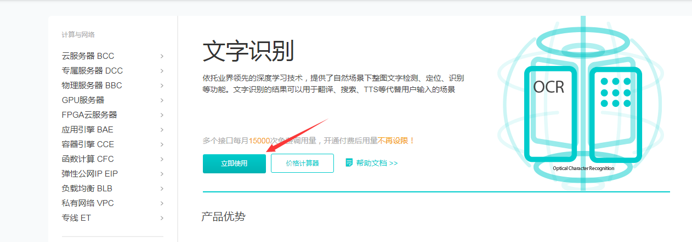
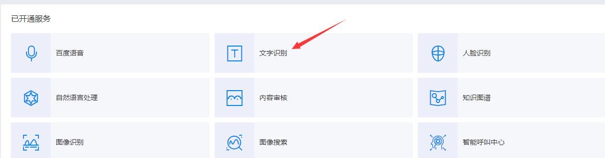
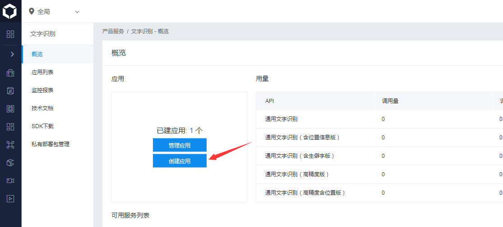
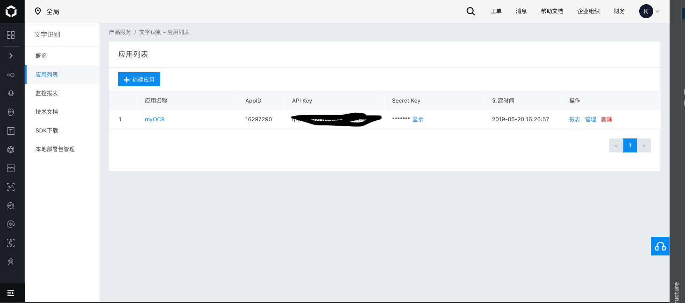

# BaiduOCR API
## Create a new account and application
This is about how to use the BaiduOCR API from [Baidu AI Open Platform](http://ai.baidu.com/), to use the deisired 
services, we need to create an account at [here](https://cloud.baidu.com/)

To use the OCR API, we need to create an application to get the API Key, Secret Key and subsequently the access token.
You can access the OCR module at [here](https://cloud.baidu.com/product/ocr.html), after creating your Baidu account at 
the step above. 

Then please follow these stpes:

Name your application then create it, you can check your AppID, API Key and Secret Key then:

## Get the access token
After we have created our OCR application, we need to get the corresponding access api by API Key and 
Secret Key, codes about this step is `testBaiduAPI.py`, you may also get some help from the [official document](http://ai.baidu.com/docs#/Auth/top).

One more thing to mention is that the official document's python codes is in not a standard 3.x version,
since there it contains `import urllib2`, so we need to do some changes in our codes, like what I've done in `testBaiduAPI.py`.

The output `content` will be in JSON format, you can have the `access_token` directly from it.

## Do the OCR work
After we have get our access_token, we can use it to do the OCR work, codes about this step is `testBaiduAPI2.py`.

In the project directory, I put two Chinese contract picture: `test1.jpg` and `test2.jpg`,
the output result is in `result.txt` and `result2.txt` respectively, the returned result `content` is a string but
actually a dictionary, you can use the `eval()` function to transfer it into a dict.

Checking the result file, we can see that the OCR accuracy is high when the picture to be recognized is in good quality. In other words,
the words inside must be clear and there should be as less spots as possible. Besides, the stamp will also affect the accuracy.
